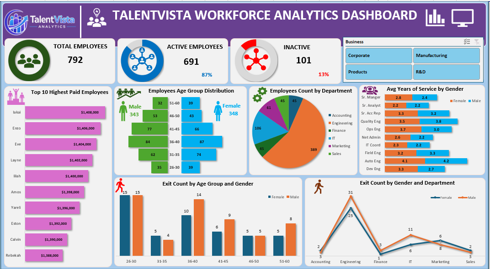
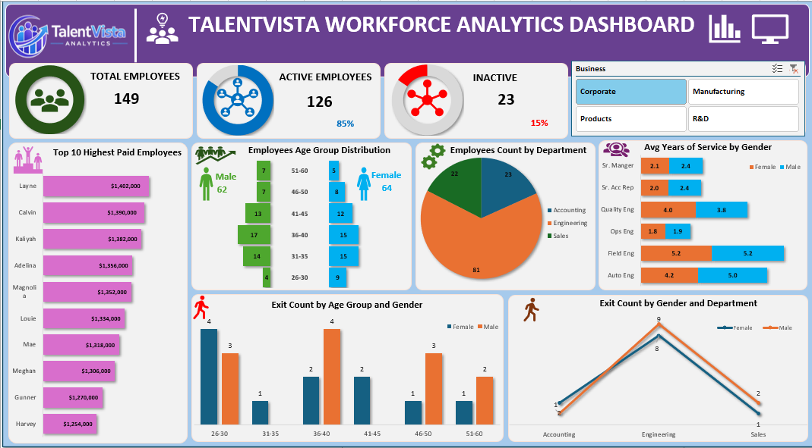

# 👥 TalentVista Workforce Analytics Dashboard

### Interactive Excel Dashboard for Workforce Analysis, HR Reporting, Employee Insights, and Business Intelligence

---

## 🚀 Project Overview

TalentVista Workforce Analytics Dashboard is an interactive Excel-based HR Analytics solution designed to monitor workforce performance, employee demographics, compensation trends, departmental distribution, and attrition patterns.

The dashboard enables HR teams and business leaders to make data-driven workforce decisions through dynamic visualizations, KPI tracking, and interactive filtering.

---

## 🎯 Business Objective

The primary objective of this project is to provide actionable workforce insights that help organizations:

* Monitor workforce composition and employee status
* Analyze departmental and business unit distribution
* Understand employee demographics and workforce trends
* Evaluate compensation and salary structures
* Identify employee attrition patterns
* Support strategic HR and workforce planning decisions

---

## ⭐ Project Highlights

* Interactive Excel Dashboard with Dynamic Visualizations
* Workforce Demographics Analysis
* Employee Attrition Monitoring
* Compensation and Salary Insights
* Department and Business Unit Analysis
* KPI-Based HR Reporting
* Workforce Performance Tracking
* Data-Driven Decision Support

---

## 📋 Dataset Information

The dataset contains workforce and employee-related information including:

* Employee Details
* Department Information
* Business Unit Data
* Employee Status
* Compensation Data
* Gender Distribution
* Age Groups
* Years of Service
* Attrition Records

This dataset enables comprehensive workforce analysis, HR reporting, and employee performance monitoring.

---

## 📈 Key Performance Indicators (KPIs)

* Total Employees: 792
* Active Employees: 691 (87%)
* Inactive Employees: 101 (13%)

---

## 🛠️ Tools & Technologies Used

* Microsoft Excel
* Pivot Tables
* Pivot Charts
* Slicers
* Conditional Formatting
* Data Visualization
* KPI Reporting
* HR Analytics
* Business Intelligence Reporting

---

## ✨ Dashboard Features

### Workforce Analysis

* Employee Distribution by Department
* Employee Distribution by Business Unit
* Age Group Analysis
* Gender Analysis

### Compensation Analysis

* Top 10 Highest Paid Employees
* Salary Distribution Insights

### Attrition Analysis

* Exit Count by Age Group
* Exit Count by Gender
* Exit Count by Department

### HR Metrics

* Average Years of Service
* Active vs Inactive Employees
* Workforce Demographics

### Interactive Features

* Dynamic Dashboard Filtering
* Interactive Visualizations
* Workforce KPI Monitoring
* User-Friendly Dashboard Navigation

---

## 📷 Dashboard Preview

### Dashboard Overview



### Workforce Analytics Insights



---

## 💡 Key Business Insights

### Workforce Composition

The organization employs 792 employees, with 87% actively working and only 13% inactive.

### Engineering Dominates Workforce

Engineering is the largest department, contributing the highest employee count across the organization.

### Strong R&D and Manufacturing Presence

R&D and Manufacturing business units account for a significant portion of the workforce, supporting innovation and operations.

### Experienced Workforce

The majority of employees belong to the 36–40 and 41–45 age groups, indicating a mature and experienced workforce.

### Competitive Compensation Strategy

The organization invests heavily in top-performing employees, with top salaries exceeding $1.4M.

### Attrition Concentrated in Mid-Career Groups

Employee exits are more frequent among the 26–30 and 36–40 age groups, highlighting potential retention opportunities.

---

## 🧠 Skills Demonstrated

* HR Analytics
* Workforce Analytics
* MIS Reporting
* Dashboard Development
* Data Visualization
* KPI Reporting
* Business Intelligence Reporting
* Workforce Planning Analysis
* Excel Reporting
* Analytical Thinking

---

## 📁 Project Structure

```text
TalentVista-Workforce-Analytics-Dashboard
│
├── README.md
├── TalentVista Workforce Analytics Dashboard.xlsm
├── Dashboard-Overview.png
├── workforce-insights.png
└── Workforce-Insights-Report.pdf
```

---

## 🚀 Future Improvements

Future enhancements may include:

* Power BI Dashboard Integration
* SQL-Based Workforce Analysis
* Automated HR Reporting
* Employee Retention Analysis
* Predictive Attrition Modeling
* Workforce Forecasting

---

## 👩‍💻 Author

**Shradha Singh**

MIS Executive | MCA Graduate | Excel Dashboard Developer | Aspiring Data Analyst

---

## 🔗 Connect With Me

* LinkedIn: https://www.linkedin.com/in/shradha-singh-42416222a
* GitHub: https://github.com/Shradha-08
